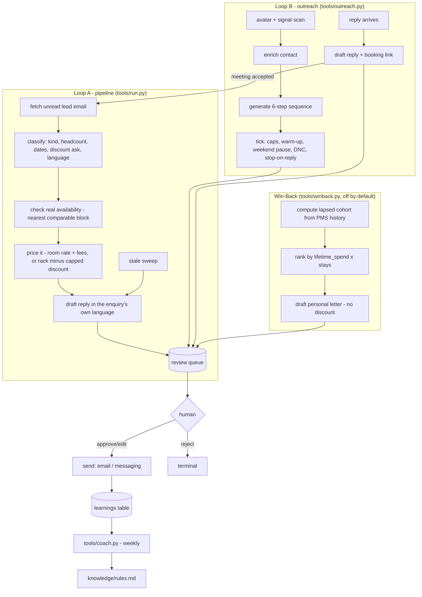

# CRM / Lead Nurture AI — "The Pursuer"

Built for the high-value bookings that matter most: group bookings,
multi-room reservations, and VIP guests.

## What it does

**Does.** Built for the high-value bookings that matter most: group
bookings, multi-room reservations, and VIP guests. It tracks each inquiry
through its full lifecycle (first contact, quote, booked, pre-arrival,
post-stay), spots the ones going stale, and sends timed, personalised
follow-ups. It also runs the outbound side: you define target avatars (or it
suggests them from your past clients), it watches signal sources for buying
triggers, finds verified contacts via Hunter.io/Findymail/Sales Navigator,
runs multi-day campaigns across LinkedIn, email, WhatsApp and Instagram
inside safe sending limits, and works every reply in one inbox with tracked
meeting-booking links.

**Won't.** Focuses on groups, multi-room, and VIP deals rather than every
one-off single-room booking. Paces follow-ups and stops the moment a lead
books, declines or replies; respects do-not-contact lists and email warm-up
limits; never pesters.

**Why.** Group and multi-room bookings are the highest-value, longest-cycle
deals you handle, and the easiest to let go cold. This is the salesperson
that never lets one slip.

**Output.** Recovers 5–15% of otherwise-lost group and VIP bookings by
chasing stale leads.

## Who it's for

A hotel, resort or independent property that takes real group, event, wedding
and incentive business - not just individual room nights - and runs it
through a small sales desk (one or two people, or a manager doing it
alongside everything else). It replaces the part of that job that is pure
volume and timing: reading every RFP the same day, quoting real availability
instead of guessing, never letting a quote go quiet, and finding new
corporate and wedding business before it finds you.

It also works for a restaurant with the same shape of problem. Built for the
bookings worth chasing: big tables, private dining, company dinners and the
firms nearby that book every month. It follows each enquiry from the first
email to booked, spots the ones going quiet, and sends a friendly nudge at
the right moment. It also goes looking - finding local companies and party
planners and starting the conversation. The pipeline's unit becomes a
big-table or private-dining enquiry instead of a room block (`est_value` =
covers × average spend), and the availability check would read a covers book
instead of a room rate calendar - `config/agent.yaml`'s `pipeline.*` block
and `knowledge/property.md` are what you re-point at your own numbers; the
code path does not change.

It is not built for single-room, one-off leisure bookings - those are
explicitly out of scope (see "What it won't do") and get pointed at your
regular booking page instead.

## How it works

Two loops share one review queue, plus one folded sub-agent and a coach
layer. `mode: shadow` is the default: nothing ever leaves the building until
a human approves it.



**Modes.** `shadow` (default): reads, thinks, drafts and queues - never
sends, never writes to your PMS. `live`: an item you approved is really
sent; everything else still waits. See `docs/safety.md`.

**The review loop.** Every draft - a lead reply, an outreach step, an
outreach inbox reply, a win-back letter - is one row in the same queue, told
apart by kind. `workflows/80-review.md` covers approve/edit/reject/send.

**What runs when.**

| Workflow | Tool | Cadence | Model calls |
|---|---|---|---|
| Pipeline inbox + stale sweep | `tools/run.py` | every 15 min | classify, draft |
| Outreach tick (send due steps) | `tools/outreach.py tick` | every 30 min, skips weekends | none - fully deterministic |
| Win-back run | `tools/winback.py cohort` + `draft` | on demand / monthly | none |
| Review queue | `tools/review.py` | whenever a human is free | none |
| Coach | `tools/coach.py analyze` | weekly, Monday 03:00 | one per correction cluster |

**Sub-agents included.** Win-Back / Loyalty AI ("The Diplomat") is folded in,
off by default - see "Sub-agents in this repo" below. The Email Optimizer /
Coach AI layer also applies to this agent and ships on by default.

Full data flow, the mermaid above in more detail, and every design decision
taken where the spec was open: `docs/how-it-works.md`.

## What you need

To run the demo below: nothing but Python 3.11+. To run it for real:

- A mailbox for the sales inbox (`docs/integrations.md` - IMAP works with
  any provider, Gmail is built).
- Your PMS's rate/availability export or API access, for real pricing
  (`csv` works with any PMS export; Cloudbeds is built).
- If you use outreach: a LinkedIn/WhatsApp/Instagram channel via your own
  UniPile account, and a Hunter.io or Findymail key for contact lookups
  (optional - `mock` previews the flow for free).
- A way to think - `llm.provider: interactive` needs only the Claude Code
  session you already have open; `claude-code` and `anthropic` are covered
  in `docs/how-it-works.md` and `docs/safety.md`.

Time: 15 minutes to see the demo and connect a mailbox; a couple of hours to
fill in your real property numbers, rules and knowledge before trusting a
live send.

## Quick start (5 minutes, no credentials)

```bash
git clone https://github.com/th1-ai/crm-lead-nurture-ai.git crm-lead-nurture-ai
cd crm-lead-nurture-ai
make setup
make demo
```

Expect to see something like:

```
CRM / Lead Nurture AI demo - Hotel Aurora

Pipeline - 4 inbound enquiry/enquiries:
  lead-01-conference-rfp: "RFP - annual partner conference, 45 delegates" -> kind=conference est_value=EUR30,150 status=needs_human
  lead-02-celebration-fr: "Anniversaire de mariage - 12 chambres en septembre" -> kind=wedding est_value=EUR4,320 status=needs_human
  lead-03-incentive-discount: "Incentive trip - 38 guests, three nights in May, budget is tight" -> kind=incentive est_value=EUR17,670 status=needs_human
  lead-04-single-room: "One room for 2 nights next month" -> kind=single_room est_value=EUR0 status=needs_human
4 of 4 need a person to look first.

Outreach:
4 prospect(s) revealed for avatar 'av-mice'.
  held out (not vetted yet): Regional exhibitor directory (AI-found)
2/3 email(s) found for 'av-mice' - EUR 0.10.
  1 do-not-contact prospect(s) skipped (not enriched).
campaign ... drafted with 6 steps - not launched yet.
launched: 2 prospect(s) enrolled. Run `tools/outreach.py tick` to work the due steps.
OUTREACH TICK - 2 queued for review, 0 queued to tomorrow (cap), 0 waiting on acceptance, 0 stale invite(s) withdrawn, 0 do-not-contact skipped.
  2 outreach step(s) queued for review.

Win-back (sub-agent, off by default):
5 lapsed guest(s) in the cohort (5 new this run), EUR 8,070.00 of lifetime spend addressed.
  top: Fatima Haddad (3 stays, EUR 2,400.00)
  top: Marco Bellini (2 stays, EUR 2,000.00)
  top: Elin Karlsson (2 stays, EUR 1,330.00)
5 letter(s) drafted. Each one waits for your approval before it reaches the guest - see workflows/25-win-back.md.
  5 win-back letter(s) queued for review.

Nothing was sent: mode is shadow, and demo never calls send() at all.
Next: `make review` to see the drafts, or read workflows/10-pipeline.md.

DEMO OK — 4 items processed, 4 drafted, 0 sent (shadow), 2 outreach step(s), 5 win-back letter(s)
```

Then `make doctor` - expect one `FAIL` (`hotel identity`, because the
property is still the shipped placeholder "Hotel Aurora") and a couple of
`warn` lines. That is the intended state of a fresh clone; see
`workflows/00-setup.md` for filling in the real property.

## Set up with Claude Code

Open `claude` in this folder and work through these prompts one phase at a
time - each names the workflow file Claude will follow.

**Phase 1 - first run.**
> Read `workflows/00-setup.md` and walk me through it: run `make setup` and
> `make demo`, then help me fill in `config/hotel.yaml` and
> `knowledge/property.md`, `knowledge/faq.md` and `knowledge/signature.md`
> with our real property details.

**Phase 2 - the pipeline's own numbers.**
> Read `docs/how-it-works.md` design decisions 1-3, then help me set
> `config/agent.yaml`'s `pipeline:` block - our real room type id, day
> delegate fee, dinner fee, and discount floor.

**Phase 3 - connect a mailbox and your PMS.**
> Read `docs/integrations.md` and help me connect `systems.email` and
> `systems.pms` in `config/hotel.yaml` to our real systems, then run
> `make doctor` until both are green.

**Phase 4 - run the pipeline for real.**
> Read `workflows/10-pipeline.md` and run one real pass with
> `make run ARGS="--limit 5"`. Show me what's waiting with `make review` and
> walk me through approving, editing or rejecting each one.

**Phase 5 - outreach (optional).**
> Read `workflows/20-outreach.md`. Help me define our first avatar and
> signal source, then run a scan, an enrich, and a campaign generate/launch
> on a small test audience before we open it up.

**Phase 6 - Win-Back (optional).**
> Read `workflows/25-win-back.md`. Turn on `subagents.win_back.enabled` in
> `config/agent.yaml`, run `python3 tools/winback.py cohort`, and show me the
> ranked list before drafting any letters.

**Phase 7 - go live.**
> Read `workflows/90-go-live.md` and walk me through the checklist. Do not
> change `mode` to `live` until every box is genuinely checked.

## Connect your systems

| System | Status | What it's used for |
|---|---|---|
| PMS (`systems.pms.adapter`) | `mock`/`csv` universal, `cloudbeds` built | Rate calendar for pipeline pricing; reservation history for the win-back cohort |
| Email (`systems.email.adapter`) | `mock`/`imap` universal, `gmail` built | Reading enquiries; sending every reply and letter |
| Messaging (`systems.messaging.adapter`) | `mock`/`webhook` universal, `unipile` built | Outreach sends (LinkedIn/WhatsApp/Instagram) and the internal staff nudge |
| Sheets (`systems.sheets.adapter`) | `csv` universal, `google` built | Exporting `make report --json` if you want it in a spreadsheet |
| Contact enrichment (`enrichment.provider`) | `mock` universal, `hunter`/`findymail` untested here | Finding verified emails for outreach prospects |
| Calendar | stub, optional | A real booked-meeting slot in `tools/outreach.py book-meeting` |
| POS, accounting, reviews, payments, procurement, locks, courier | stubs, unused | Not called by this agent |

Full detail, exact env vars, and the "implement your own" recipe for
anything you need that is not built yet: `docs/integrations.md`. Check
what is actually working on your machine at any time:

```bash
make doctor
```

## Run it

```bash
make run                          # one pipeline pass
make run ARGS="--limit 5"         # just the first five messages
make run ARGS="--dry-run"         # compute everything, write nothing at all
make watch                        # keep running on the configured interval
make review                       # what is waiting for a human
python3 tools/pipeline.py funnel   # the desk, ordered by value
python3 tools/outreach.py tick     # work due outreach steps
python3 tools/winback.py cohort    # compute the lapsed cohort (if enabled)
make report                       # what happened, and what it cost
```

`--dry-run` writes nothing at all - not a database row, not a follow-up
task - so it is safe to run any number of times while you are tuning a
prompt.

**Scheduling.** Every recurring job is listed in `config/agent.yaml`'s
`schedule:` block with what to run and how often:

```bash
python3 tools/schedule.py --all              # one snippet per scheduled job (cron)
python3 tools/schedule.py --all --target launchd   # macOS laptop
python3 tools/schedule.py --all --target systemd   # Linux server
```

`scheduler/crontab.example` shows the same output for a quick copy-paste.
Three jobs by default: the pipeline every 15 minutes, the outreach tick
every 30 minutes (it skips weekends itself), and the coach weekly on Monday.
Outreach replies and win-back are operator-triggered, not scheduled - see
`workflows/20-outreach.md` and `workflows/25-win-back.md`.

**Subscription or API.** `llm.provider: interactive` or `claude-code` runs
on the Claude Code subscription you already have - free beyond what you are
already paying, and the best way to learn how the pipeline thinks.
`anthropic` (your own API key) is the right choice for production volume,
where a personal subscription's rate limits and usage policy would bite.
`docs/safety.md` has the honest version of this trade-off.

## Go live

`workflows/90-go-live.md` is the full checklist - the property's real
details filled in, real pricing numbers set, a few days of real drafts
reviewed, a real mailbox connected, and the shadow-era backlog cleared with
`python3 tools/review.py stale` before you flip the switch.

```yaml
# config/hotel.yaml
mode: live
```

Going live means **approved drafts get sent** - it does not turn on
autonomous sending. `review.require_approval_for` still lists `send_email`
and `send_message` by default, and there is no config that changes that for
a single-room enquiry, a flagged discount, or an unsupported language - see
"Guardrails & safety" below. Go back to `shadow` any time, mid-schedule, with
no other change.

## Guardrails & safety

- **Nothing sends itself.** Every draft - pipeline reply, outreach step,
  outreach inbox reply, win-back letter - waits for a human. `mode: shadow`
  blocks every guarded write, approved or not.
- **The discount floor is enforced before a model ever sees the number.**
  `pipeline.discount_floor_pct` clamps the ask; a deeper request is always
  flagged for sign-off, never silently granted.
- **Never quotes space that was not checked.** No comparable open date in
  the published rate window means the draft says so honestly.
- **Out of scope, not silently dropped.** A single-room enquiry always gets
  a real, honest reply pointing at your regular booking page, and always
  waits for a human.
- **Only replies in a language you have configured.** An enquiry outside
  `hotel.languages` gets your default language and always needs a human.
- **Win-back never offers a discount.** The letter templates cannot emit a
  `%` sign - the cap is structural, not a prompt instruction.
- **Outreach respects real sending limits.** Daily caps, a warm-up ramp for
  new channels, a weekend pause, an immediate stop the moment a prospect
  replies, and do-not-contact suppression - all enforced in code, not just
  documented.
- **Card numbers and IBANs are redacted on ingestion**, always on.
- **EU AI Act Article 50 disclosure.** Every outbound email gets
  `knowledge/signature.md` appended automatically
  (the `with_signature()` method on `core/adapters/base.py`'s `Email` class) - that is where your
  sign-off and the AI-disclosure line live, so no code path can forget it:
  > This reply was prepared with AI assistance and reviewed by our team
  > before it was sent. Reply to this message any time to reach a person
  > directly.

Full detail, GDPR notes, and the subscription-vs-API note: `docs/safety.md`.

## Sub-agents in this repo

### Win-Back / Loyalty AI — "The Diplomat"

Off by default (`subagents.win_back.enabled: false`) - the pipeline and
outreach work fully without it.

**Does.** Spots lapsing past guests, ranks them by lifetime value, and
writes each a personal win-back citing the true reason to return - the
noisy-room issue you've since fixed, the suite they loved. When a guest says
yes it books the repeat stay straight into the PMS. Runs a light loyalty
program alongside (birthdays, anniversaries, return-stay perks).

**Won't.** Caps discounting; won't spam.

**Why.** A repeat guest is far cheaper than a new one; most properties never
re-market.

**Output.** 10–25% of past guests are reachable for a repeat stay with the
right nudge.

Turn it on, compute the cohort from your real reservation history, and draft
letters: `workflows/25-win-back.md`. What is honestly not built (the
calendar-triggered loyalty half) and the PMS-write limitation: `docs/sub-agents.md`.

### Email Optimizer / Coach AI

On by default - analysis only, never touches a lead, a prospect or a guest.

**Does.** The coach class. Each week it reads every guest reply a human
edited, rejected, or thumbed-down, clusters the corrections into patterns,
applies the safe knowledge-base fixes itself, and proposes the rest. A
sibling captures every human edit as a training pair, so the whole roster
keeps getting sharper. A live quality board tracks the numbers that matter -
replies sent unchanged, edit severity, hand-off rate - so you watch each
agent earn its autonomy week by week.

**Won't.** Doesn't talk to guests. Holds the higher-judgement changes for a
human nod; applies the clear-cut ones itself.

**Output.** Drives the human-edit rate down week over week; agents graduate
to full autonomy as their edit rate falls below 10%.

Weekly loop, what a proposal looks like, and how `apply` works:
`workflows/85-coach-weekly.md`.

## Customising

- **`knowledge/`** - `knowledge/property.md` and `knowledge/faq.md` are what
  the draft prompt grounds itself in; `knowledge/signature.md` is your
  sign-off and the AI-disclosure line, appended to every outbound email
  automatically. `knowledge/rules.md` is written by the coach's `apply` step
  - edit or delete a line by hand any time.
- **`prompts/`** - `prompts/classify.md` and `prompts/draft.md` (the
  pipeline) and `prompts/coach-suggestion.md` are plain markdown with
  `{{placeholders}}`. Edit the
  instructions directly; `prompts/schemas/*.json` define the exact shape the
  model must answer in.
- **`config/agent.yaml`** - every threshold and formula input: the discount
  floor, the large-group cutoff, day-delegate and dinner fees, staleness
  timing, outreach caps and warm-up, win-back's lapse window and concession
  list, the coach's cluster size.
- **Outreach templates** - the six message templates and the per-signal
  hook openers live in `tools/outreach.py` (`render_step`, `hook_for`) -
  plain Python, not a config file, since they are short and easiest to read
  as code.
- **Win-back letters** - the five reason-category templates live in
  `tools/winback.py` (`_LETTERS`). Add a category by adding a keyword list
  to `_CATEGORY_KEYWORDS` and a template to `_LETTERS`.
- **Adding a language** - add the code to `hotel.languages` in
  `config/hotel.yaml`; `core/i18n.py` already knows `en fr de es it pt nl
  sv`. An enquiry in any other language still falls back to your default and
  needs a human - see `docs/how-it-works.md`.
- **The restaurant lens** - see "Who it's for" above; re-point
  `knowledge/property.md` and `config/agent.yaml`'s pricing fields at your
  own numbers, the code path is unchanged.

## Troubleshooting & FAQ

Full list, with fix hints for every `make doctor` FAIL:
`workflows/99-troubleshooting.md`. The most common ones:

- **`make demo` doesn't print `DEMO OK`.** Run `make setup` first; check
  `fixtures/inbound/*.json` and `fixtures/hotel/*.json` are unmodified.
- **`make run` exits with code 3.** Not an error - `llm.provider:
  interactive` parked a question for you in `data/pending/`. Answer it and
  re-run the same command.
- **"blocked: no prospect with a verified email."** Run `scan` then `enrich`
  first, and check whether a source is still `pending`
  (`python3 tools/outreach.py sources`).
- **The win-back cohort is empty.** You need real, checked-out reservation
  history further back than `winback.lapse_after_days` - a brand-new
  property has nobody to win back yet.
- **Why does every enquiry need a human?** By design - this desk is built
  for exactly the deals worth a second pair of eyes. Raise
  `pipeline.confidence_threshold` or lower `pipeline.large_group_headcount`
  once you trust the drafts for your smallest routine group size.

**Q: Can I use this for a single agent without the others?** Yes - the
pipeline, outreach and win-back are three independent tools sharing one
database and one review queue. Run only `tools/run.py` if outbound
prospecting is not something you do.

**Q: What happens to a lead outreach books a meeting for?** It lands on the
pipeline at stage `inquiry` with the meeting time as its next step - see
`workflows/20-outreach.md`, "when a prospect responds".

## Measuring the benefit

**Output.** Recovers 5–15% of otherwise-lost group and VIP bookings by
chasing stale leads.

**ROI.** +10% Group & VIP bookings recovered (revenue)

```bash
make report
python3 tools/report.py --json
```

Shows pipeline volume and value, the auto-handled and edit rates, the
outreach funnel, and win-back's cohort size and recorded revenue. Full detail
on what each number means and its honest caveats: `docs/benefits.md`.

## About

Built by [TH1](https://th1.ai) as part of its open-source family of hotel
AI-agent templates. Every repo in the family shares the same shape - learn
one, you have learned them all.

**Licence.** MIT - see `LICENSE`.

**Want it run for you, tuned, and kept up to date?** TH1 runs this stack for
hotel groups who would rather not manage the prompts and the sub-agents
themselves. [th1.ai](https://th1.ai)

**Changelog.** This is the first published version of this template.
