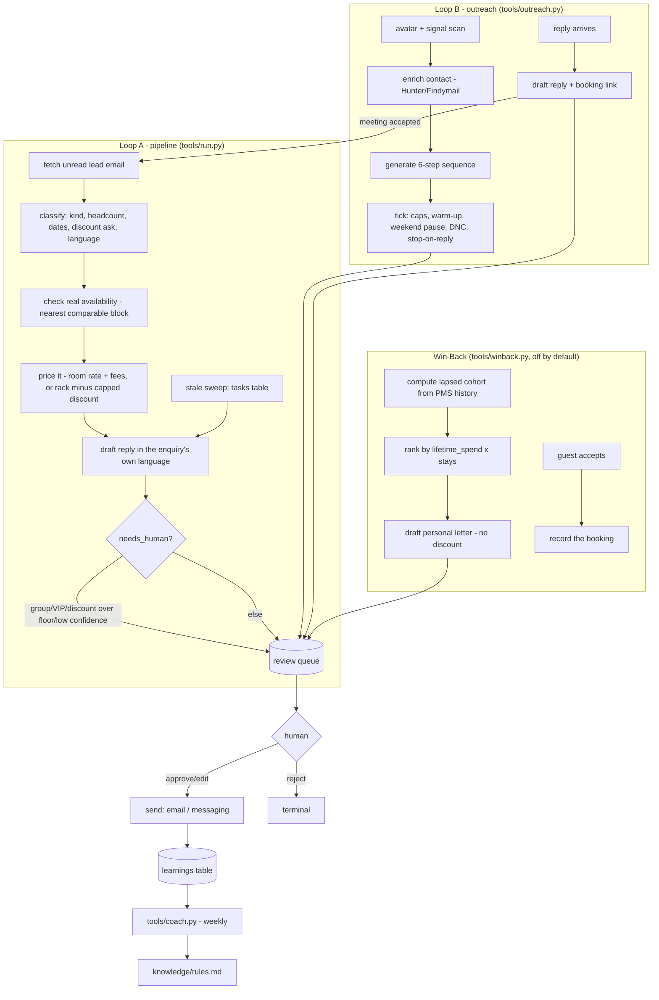

# How CRM / Lead Nurture AI works

CRM / Lead Nurture AI ("The Pursuer") runs two loops over one review queue, plus
one folded sub-agent and the coach layer. Every write — an email, a LinkedIn
message, a PMS note — goes through `core/review.py`'s guard exactly like every
other agent in this family: `mode: shadow` is the default and nothing leaves the
building until a human approves it.

## The two loops

**Loop A — the pipeline (inbound).** A group, multi-room or VIP enquiry comes in
by email. The agent reads it, works out what it is, checks real availability,
prices it, and drafts a reply — then waits. It also watches every open enquiry
for the ones going quiet and drafts a nudge before they die. This is
`tools/engine.py` + `tools/pipeline.py`, run by `tools/run.py`.

**Loop B — outreach (outbound).** You define who you want more of (an avatar),
the agent watches signal sources for people who match, finds their contact
details, and runs a short multi-channel sequence — LinkedIn, email, WhatsApp,
Instagram — inside safe sending limits. A reply lands in one inbox and can book
a meeting, which hands a fresh lead back to Loop A. This is `tools/outreach.py`.

**Sub-agent — Win-Back / Loyalty AI ("The Diplomat").** Off by default
(`subagents.win_back.enabled`). Finds guests who have quietly stopped coming
back, ranks them by what they are worth, and writes each one a personal letter
citing their real history — never "we miss you", never a discount. `tools/winback.py`.
See `docs/sub-agents.md`.

**Coach — Email Optimizer / Coach AI.** Reads every edit and rejection across
both loops and the sub-agent, clusters the repeat patterns, and proposes a fix.
Never touches a guest or a prospect. `tools/coach.py` + `workflows/85-coach-weekly.md`.

## What runs when

| Workflow | Tool | Cadence | Provider calls |
|---|---|---|---|
| Pipeline inbox + stale sweep | `tools/run.py` | every 15 min | `classify`, `draft` |
| Outreach tick (send due steps) | `tools/outreach.py tick` | every 30 min, skips weekends | none (deterministic) |
| Outreach inbox | `tools/outreach.py inbox` | every 15 min | none (deterministic) |
| Win-back run | `tools/winback.py cohort` + `draft` | on demand / monthly | none (deterministic) |
| Review queue | `tools/review.py` | whenever a human is free | none |
| Send | `tools/review.py send` or `tools/run.py`'s claim step | every pass | none |
| Coach | `tools/coach.py analyze` | weekly (Monday 03:00) | `coach-suggestion` |
| Report | `tools/report.py` | on demand | none |

## Design decisions (the spec was open on these)

**1. Staleness is real, not seeded.** The demo this is ported from never actually
detects a stale lead — `specs/crm-lead-nurture-ai.md` §11.3 flags it as an open
gap between the promise and the code. This template closes it: every lead item
gets a follow-up task in `core.store`'s `tasks` table
(`upsert_task("lead_followup", lead_id, ...)`). `tools/run.py` sweeps
`due_tasks()` every pass and drafts a nudge for anything sitting in
`pending_review`/`needs_human` past `agent.stale_after_days` (default 3),
escalating to a human after `agent.max_follow_ups` (default 3) with no reply —
the exact tickler mechanic `core/store.py` documents for "chase a supplier,
re-ask a guest".

**2. Drafting generalises past the first lead.** The source engine hand-authors
a reply per lead id (`sl-1`, `sl-4`, `sl-6`) and falls back to one generic
template for anyone else (spec §11.4). This template has no ids to fall back
on: `tools/engine.py:classify_lead` extracts `kind` (conference / wedding /
incentive / group / single_room / other), headcount, dates and a discount ask
from the free-text enquiry with one LLM call against a schema; `price_lead`
computes the numbers deterministically from those facts; `draft_lead_reply`
asks the model for prose only, handed the computed facts as pre-formatted
strings (never raw numbers — see the note on money below) so it cannot
mis-price anything, only mis-word it.

**3. Discount floor is enforced before the model ever sees a number.**
`engine.clamp_discount()` runs first; the draft prompt receives the *already
clamped* percentage and a `flagged_for_signoff` flag, never the guest's raw
ask. A model cannot override a floor it never sees.

**4. Win-back is computed, not hand-picked.** The source seeds an
already-seleted cohort (spec §11.2); this template computes it from
`pms.list_reservations` grouped by guest — lapsed = no stay in
`winback.lapse_after_days` (default 270 ≈ 9 months), qualifying = 2+ past
stays. See `tools/winback.py:compute_cohort`.

**5. Win-back letters are deterministic, not model-written.** The source's six
letters are hand-authored and don't generalise (spec §11.3); an LLM-written
letter about a discount is exactly the kind of guest-facing money claim this
family avoids leaving to a model (see `docs/safety.md`). Instead
`tools/winback.py:draft_letter` picks one of five reason-category templates
(noise/renovation, spa/preference pattern, unsold-inventory, price comparison,
general) from a keyword match on the guest's own `reason_to_return` note, and
interpolates the guest's name, pattern and one concession from
`winback.concessions` (config, never a discount — `winback.max_discount_pct`
defaults to `0` and a template can never emit a `%` sign). This is stricter
than the source, which enforced the "no discount" rule only by convention.

**6. No PMS can generically create a reservation.** `core/adapters/base.py`'s
`PMS` interface deliberately has no `create_reservation` — every vendor's
booking-creation shape is different and it is too easy to get wrong
generically (see `docs/integrations.md`). So the "books the repeat stay
straight into the PMS" promise works like this: when a guest accepts,
`tools/winback.py mark-accepted` calls `pms.add_note()` on their most recent
past reservation if one exists (so the history is visible in the PMS), records
the rebooking in this agent's own `winback_bookings` table (the source for the
Win-back revenue metric in `make report`), and the workflow tells you to enter
the stay in your PMS. If your PMS adapter grows a `create_reservation` method
later, `tools/winback.py` calls it automatically when present (`getattr` duck
typing, no core change needed) — see `docs/integrations.md#implement-your-own`.

**7. Outreach is fully deterministic, on purpose — mirroring the source.** The
platform's own outreach engine states "no LLM anywhere in here" for avatars,
signals, enrichment, campaign generation and message rendering. This template
keeps that: `hookFor()` (the per-lead opener) is a pure keyword match, message
rendering is `{{placeholder}}` substitution, and the campaign ladder, caps,
warm-up ramp, weekend pause and stop-on-reply are all plain rules over
`core.store`'s `tasks` table, reused as the enrollment tickler.

**8. LinkedIn "visit" and "like" have no send shape.** `core.adapters.base.Messaging`
can `send()` a message and `notify_staff()`, but there is no universal API for
"open this profile and click like" — that is a browser action, not a message.
`tools/outreach.py` turns those two ladder steps into one `notify_staff()`
nudge with the exact instruction, rather than pretending to automate them. The
connection request, the LinkedIn message, WhatsApp and Instagram DM are all
real `messaging.send()` calls (UniPile supports all four in reality); the
withdraw-stale-invite guardrail is also a `notify_staff()` nudge, not a step in
the ladder, since withdrawing isn't a "send" either.

**9. Contact enrichment isn't a `core/adapters` family.** Hunter.io and
Findymail are single-purpose, account-specific lookup APIs, not a protocol
every PMS/mailbox/chat system shares the shape of the way IMAP or CSV export
do — so they don't fit the adapter registry's honesty levels cleanly. They live
in `tools/enrichment.py` instead: a thin HTTP client per provider, `stub`
until you add your own key (see `docs/integrations.md`), with the real cost
constants (`hunter: €0.034/lookup`, `findymail: €0.049/lookup`) so `make demo`
shows a realistic cost ticker on `mock` data with no key at all.

**10. One review queue, one item shape.** Pipeline replies, outreach steps,
outreach inbox replies and win-back letters all go through `core.store`'s
`items` table (`kind` tells them apart: `lead_reply`, `outreach_step`,
`outreach_reply`, `winback_letter`). `tools/review.py` is generic across all
four; only the `send` dispatch looks at `kind` and `payload.channel` to decide
whether to call the email adapter or the messaging adapter.

**11. Restaurant lens.** `venues: [hotel, restaurant]` — for a restaurant, the
pipeline's unit becomes a big-table or private-dining enquiry (`est_value` =
covers x average spend instead of room-nights) and the availability check reads
a covers book instead of a rate calendar. Nothing in the code path changes;
only `knowledge/property.md` and `config/agent.yaml`'s `event_room_type` /
pricing fields need re-pointing at a restaurant's own numbers. See
`README.md` "Who it's for".

## Money in prompts

Every euro amount handed to the model is a pre-formatted string
(`"€37,350"`, never `37350`) — the documented lesson from this family's
upsell agent: a model asked to reproduce a raw number sometimes drops the
currency sign. `tools/engine.py` and `tools/winback.py` format every amount
before it reaches a prompt or a fixture.
